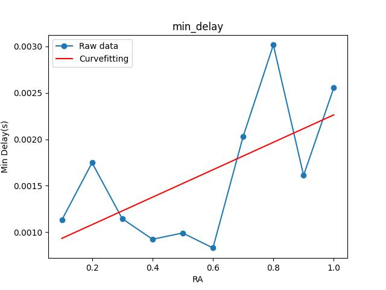
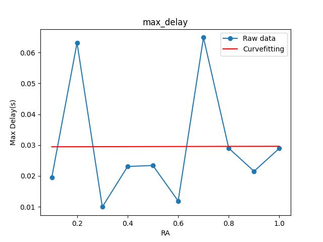
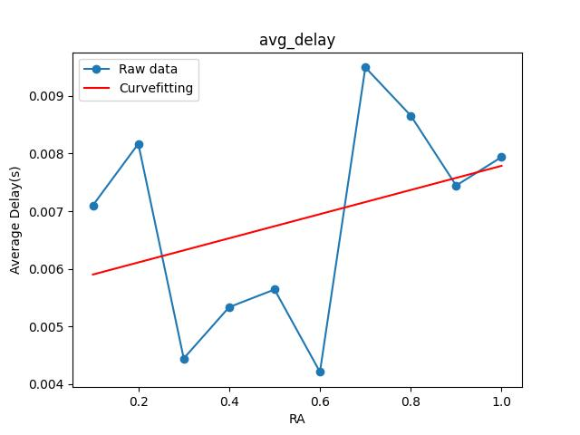
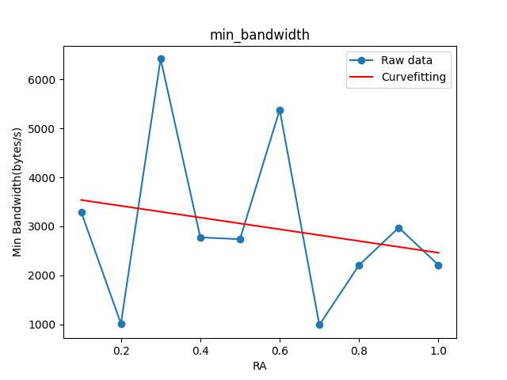
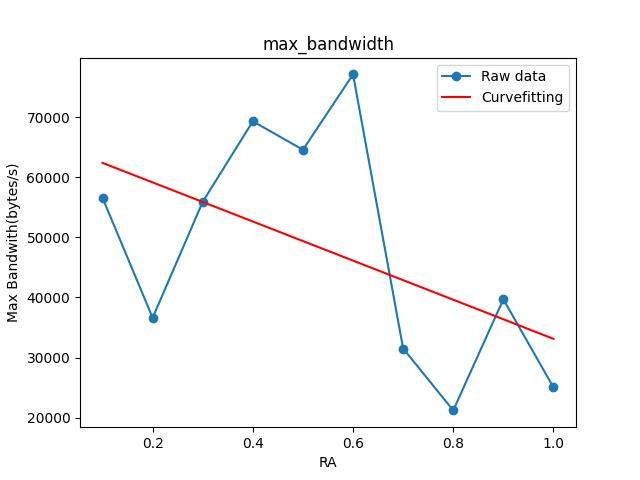
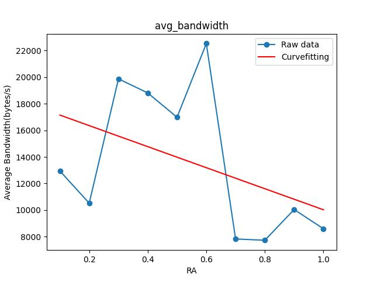

# <center> ECE 428 MP0 </center>

## Introduction
This is ECE 428 Distribution Systems MP0.

### Codebase
This projects use three python files to simulate message interaction in distributed system. The codebase of the project is as follows.

```
.
├── generator.py    
├── logger.py       # logger(server) python file
├── logs            # directories containing message logs for task 2
├── metrics         # directories containing metrics for task 2
├── mp0.pdf
├── node.py         # node(client) python file
├── plot.py         # drawing plot python file
├── plots           # directories containing output figures
└── README.md
```

### General design choices

The general design is to set server role for the logger and set client role for the nodes. One or more nodes will send messages created by `generator.py` to the logger through TCP protocol(python socket module). The logger will keep listening messages from nodes. To enable multiple nodes to send messages simultaneously, multithread is used. Also, the logger and node communicates in a ping-ack mode, to ensure messages are delivered correctly.
 
## Requirement

- Language
    - Python

- Python Packages
    - os
    - sys
    - time
    - socket, required to use TCP protocol to transfer messages
    - threading, required to support multiple nodes to connect to logger simultaneously
    - numpy,pandas,matplotlib, used to analyze data and draw figures.
- Operating systems  
I tried on Ubuntu 20.04.5 LTS on Windows 10 x86_64 (WSL) and Arch Linux x86_64. Other operating systems are not tried but should work.

## Instructions  
1. Start the logger
```
python logger.py <path to logfile> <path to metricfile>
```
For convenience, you can just try `python logger.py ./logger.log ./metric.csv` and the output message log file as well as metric file will be in current directory after you start the node in next step.

2. Open another terminal and go to the same directory. Run the following:
```
python -u generator.py <rate> <msg_num> | python node.py <node_name> <ip> <port>
```
Replace `<rate> <msg_num> <node_name> <ip> <port>` to any reasonable value you like. According to the mp0 file, <ip> is `127.0.0.1` and port is `1234`

To support multiple nodes, add `$` between two or more commands. For example, the following is one of commands used to do task 2 and get the data.
```
python -u generator.py 0.1 100 | python node.py A 127.0.0.1 1234 & python -u generator.py 1 100 | python node.py B 127.0.0.1 1234 & python -u generator.py 2 100 | python node.py C 127.0.0.1 1234 &
```
The messages as well as their indices will be printed to help know the progress of the sending process.

## Delay and Bandwidth Measurement
- Delay  
    Besides the messages, each node also send the time this message generated to the logger. When this message is sent to the logger,logger records the time. The difference of these two time is used to measure delay.
- Bandwidth  
    The bytes of a message is measure using its length in UTF-8 coding as each character has a size of one byte. The bytes is divided by delay to measure the bandwidth.


## Plots and Figures


<div align="center">








</div>

For the plots, both the original data graph and linear curve fitting graph are presented. As only 100 messages are tried with 10 different rates of node A, the data may not be persuasive enough. But from the curve fitting line, we can still conclude that as the frequency of letters increase, the transmission delay will increase and the bandwidth will decrease. One possible reason is that as messages are sent more frequently, it takes more time for the logger to record this message and there's possibility of jamming. 


