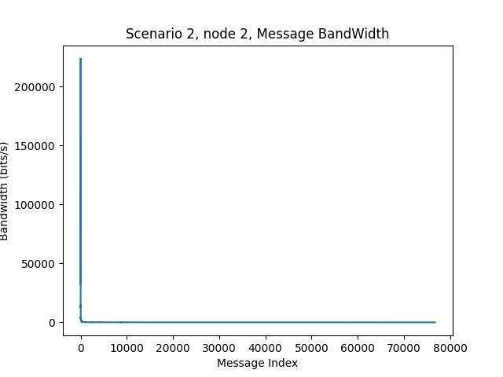
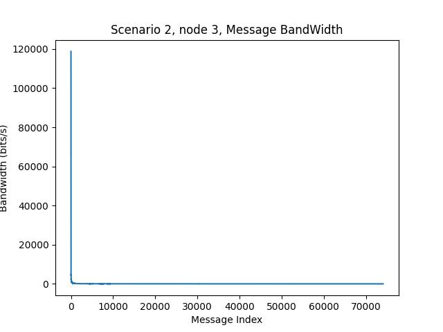
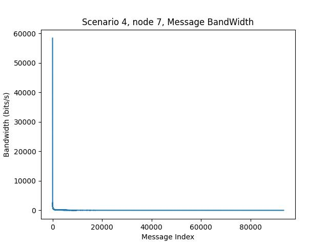

# ECE 428 MP1

## Overview

In this mp, we use ISIS algorithm to achieve total ordering in a transaction system. It is simulated with 3 and 8 nodes with some node failure. The overview of files are as follows.

```
.
├── data.py				# Python file to collect data and draw graph
├── gentx.py
├── metrics				# Directory of metrics
│   ├── scenario1
│   ├── scenario2
│   ├── scenario3
│   └── scenario4
├── mp1_node			
├── mp1.pdf
├── node.py				# Code to implement ISIS algorithm
├── README.md
└── tests				# Provided config files
    ├── 3node
    └── 8node
```

## Build Instruction

### Requirement

- Python 
- Python library `socket`, `sys`, `time`, `threading`
- Python library `numpy`, `pandas`, `matplotlib`

It is tested on Windows environment with Git Bash, Arch Linux on Windows 10 with Python version `3.10.10`. It should work as well in other OS environment.

### Run

Change `SCENARIO_NUM` to your desired value at the top of `node.py`. This determines the output direcotory of bandwidth and process time. It's set to `1` by default, which means the output will be in directory `metrics/scenario1/table`

 Under the directory of `mp1`, run the following command to start node1. Replace `<>` with your desired parameter
```
python -u gentx.py <ratio> | ./mp1_node <nodename> <port> ./tests/<# of node> node/config<node>.txt
```
Or on Ubuntu:
```
python3 -u gentx.py <ratio> | python3 <nodename> <port> ./tests/<#node> node/config<node>.txt
```

For example, I want to run node1, I should run the following command: 

```
python -u gentx.py 0.5 | ./mp1_node node1 1234 ./tests/3node/config1.txt
```

Then the node will start waiting for connection from other nodes. Do similar things to start node2 and node3 on other terminals to start transaction process. The configuration for 3 node situation and 8 node situation is already provided. Note that the `port` you provided in the command line must match the `port` in config file. To try out other number of nodes, write similar config files.

To simulate the failure of a node, one can press `ctrl+c` to interrupt the current process.


### Limitation

1. For simplity, we use the node index of a nodename to represent `node_id`, which may not be a good idea. So your node name can only be something like `node1`, `node2` instead of `A`, `1`. Also, if you use node name `node11`, it may not be supported. 


## Design document

### Description of the protocol design

For message transmission, the distributed system uses ISIS algorithm to ensure that message transmission between nodes conforms to total ordering. Also, in order to achieve reliable message delivery, the system uses R-multicast instead of B-multicast. The system can also handle failures. For information processing, the system uses a function to process the transaction information generated by `gentx.py`

### Ensure total ordering (justification)

1. First, we define the class `hold_queue`. Each node will maintain a queue. The elements in queue would have included `msg_content`, `msg_id`, `final_priority`,`deliverable`, `suggestor`, `[[turn,suggestor].....]` And all the necessary elements. Where `msg_content` is the content of the transaction, `msg_id` is the unique key used to mark the transaction, `final_priority` is the final agreed priority, The deliverable value of 1 indicates that the information can be delivered. suggestor is the node that provides the suggestion. `[[turn, suggestor], [turn,suggestor]....]` Is a `feedbacklist`. It is worth noting that feedbacklist only has content if the node is the producer of the `msg_content`, otherwise it is empty.

2. There are three kinds of messages between nodes, generated by three functions, `askMessage`, `feedbackMessage` and `decidedMessage`. In other words, it represents the ask, feedback and decided information, which is to realize the ISIS algorithm.

3. The ISIS algorithm uses two orders, `turn`, which is only added when node is created. The other one is `si`. It will change when it receives an ask message and a decided message.


4. Next, describe the flow of the function from scratch.
	1. First, each node's main function creates send_channel and receive_channel for all other nodes. Once all connections have been established, main will start a number of receive_message threads to receive messages from other nodes separately. The function will continuously generate `askMessage` using the Gentx-generated transaction.

	2. The receive message will result in different responses depending on the type of message received.

	3. With `askMessage`, the node receiving the message first places the corresponding transaction in the hold_queue. `si += 1` and then send the `feedbackmessage`.

	4. For a feedback message, the node receiving the message first puts the proposed priority into the corresponding feedbacklist. If the number of `Feedbacklists` reaches the total number of nodes, it means we can decide the order in which feedbacklists should be delivered, so we send a decide message and deliver this element in our queue.

	5. When the decided message is received, update priority, `deliverable` and `suggestor`, sort the queue, and deliver the appropriate elements.

Through the above operations, we fully fit the ISIS algorithm.


#### Proof of the correctness of ISIS	

We can consider two messages m1, m2 and two processes p1 and p2. 


And then we use proof by contradiction.
First of all, let's say that p delivers m1 and then it delivers m2. When p receives m1, which means m1 is at the head of the queue, there are three scenarios for m2.

1. In queue and deliverable, which means its $Final\_priority(m1) < Final\_priority(m2)$
2. In queue and undeliverable, 
then $Final\_priority(m1)<Proposed\_priority (m2) <=Final\_priority(m2)$
3. If it's not in the queue.
Then he $Final\_priority(m1)<Proposed\_priority (m2) <=Final\_priority(m2)$

So this ensures total ordering


### Ensure a reliable message delivery under failures (justification)

We made sure we had a reliable message by using R-multicast.

Specifically, each node maintains a `seen_typemid`. Seen_message example is `ask | 1 1,` ` feedback | 1  1| feebacker: 2`,  `decided | 1 1`, because `msg_type + mid` for feedback information is not enough.

When the node receives the information, it determines whether the information exists in `seen_typemid`. If it does, it skips processing the information. Otherwise, it adds the information to the list, processes the information, and multicast it to the group again.

In this way, we achieve R-multicast, which means reliable multicast is achieved.

We handle failure by adding a try to main, except for failure.
When we press `ctrl+c`, the main program enters except and sets `terminate =1`. 

receive_message thread will close if detect that `terminate = 1`. it will also be closed if it receive somthing that is not data, which means that they detect other node's failure.
At this point, wait for all of the `receive_message` threads to close, then use the handle failure function to handle any sequence conflicts.


## Performance Evaluation Graph

The output files are located in directory `metrics`. Output for each scenario is separated individually. Each scenario contains `table`, list of data collection and `figure`, the performance evaluation graph.

Note that in the situation of 8 nodes and 5 Hz. The bandwidth decreases dramatically after some time, which lead to a peak on the left of the graph and small value on the rest of the graph. 

### Scenario 1


### Scenario 2






### Scenario 3


### Scenario 4





